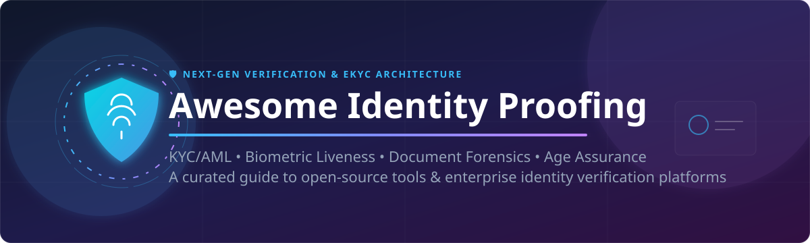

# Awesome Identity Proofing Platform 🛡️

    

  

## 📌 Top Identity Proofing Platforms & eKYC Tools

A comprehensive, SEO-optimized curated list of leading identity proofing, eKYC/AML compliance, document authentication, biometric facial recognition, liveness detection, age assurance, and fraud prevention platforms.

> **Primary focus:** Production-ready open-source identity verification software, biometric SDKs, and zero-knowledge privacy tools. Commercial and hosted SaaS platforms are detailed below with company valuation/revenue metrics and explicit pricing breakdowns.

---

## 🏢 SaaS / Hosted Platforms

*(Sorted by estimated company size / valuation / revenue in descending order)*

| Platform | Company Size (Valuation / Revenue) | Description | Key Focus | Pricing | Free Tier / Trial Limits |
|----------|-----------------------------------|-------------|-----------|---------|--------------------------|
| **[Onfido](https://www.entrust.com/)** (Entrust) | **~$650M Valuation** (Acquired by Entrust; ~$140M ARR / Parent Entrust $800M+ Rev) | Document + biometric identity verification with AI analysis, fraud signals, and global coverage. Widely used for digital onboarding and compliance. | Document + face verification | Enterprise custom contracts based on volume and verification modules (annual minimums apply) | No self-service free trial or free tier; access to sandbox and testing requires sales interaction |
| **[Socure](https://www.socure.com/)** | **~$4.5B Valuation** (~$100M+ ARR) | Identity graph-powered verification and risk platform. Strong PII matching, document + biometric checks, and high-assurance proofing (including IAL2-aligned flows). | Data-driven identity graph & risk scoring | Socure Launch tier starts at ~$0.80–$1.30 per evaluation; enterprise contracts typically start at $50,000+/year | Socure Launch program offers $1,000 per month in platform credits for startups; no standard standalone free trial |
| **[Trulioo](https://www.trulioo.com/)** | **~$2.0B Valuation** (~$50M+ ARR) | Global KYC platform with person match, document verification (14,000+ IDs), business verification (KYB), and AML screening across 195+ countries via a single API. | Global person + business identity data | Custom enterprise contract pricing based on verification volume and API modules selected | No free trial or free tier; developer demo API key provided upon sales contact |
| **[Persona](https://withpersona.com/)** | **~$1.5B Valuation** (~$70M+ ARR) | Flexible identity verification platform supporting government ID, selfie + liveness, phone, document, and reusable identity flows. Strong for customizable KYC, age verification, and fraud prevention across industries. | Modular identity proofing & reusable identities | Starter plan available for free; Growth / Enterprise plans feature custom quote pricing | Free Starter plan includes up to 500 free identity verifications per month; unlimited mocked verifications in Sandbox environment |
| **[Incode](https://www.incode.com/)** | **~$1.25B Valuation** (~$40M+ ARR) | Advanced AI identity verification with proprietary facial recognition, multi-modal liveness, document forensics, age estimation, and government-record matching (e.g., DMV). | High-accuracy biometrics & government-grade verification | Custom enterprise contract pricing based on implementation scale and verification volume | No public free tier or free trial; sandbox/Proof of Concept (POC) environment offered for enterprise sales evaluations |
| **[Jumio](https://www.jumio.com/)** | **~$1.0B Valuation** (~$150M+ ARR) | AI-powered identity verification with document authenticity checks, selfie + liveness, biometrics, and continuous identity intelligence. High global ID coverage and deepfake resistance. | Automated ID + biometric verification | Enterprise volume-based custom quotes (typically starting around $0.30–$5.00+ per transaction depending on volume) | No self-serve free trial or free plan; live interactive demo and TCO calculator available upon request |
| **[Veriff](https://www.veriff.com/)** | **~$1.5B Valuation** (~$70M+ ARR) | Fast AI-driven identity and document verification supporting 12,500+ documents across 230+ countries. Strong conversion rates and multi-language support. | Global document + identity verification | Self-serve paid plans start at $49/month ($0.80/verification for Essential plan; $99/month for Plus plan) | 15-day free trial supporting up to 50 verification sessions (no credit card required) |
| **[AU10TIX](https://www.au10tix.com/)** | **~$500M+ Valuation** (~$60M+ ARR) | High-assurance identity proofing with deep document forensics, anti-deepfake biometrics, cross-signal intelligence, and reusable digital ID capabilities (including Microsoft Entra integration). | Border/airline-grade forensics & reusable IDs | Sales-led custom enterprise pricing with a minimum commitment starting at $500/month | No free trial or free tier; customized live demonstration available upon request |
| **[IDnow](https://www.idnow.io/)** | **~$350M+ Valuation** (~$50M+ ARR) | European-focused identity verification with video identification, document checks, and eID support. Strong regulatory compliance in the EU. | Video ID & regulated market verification | Custom quote-based pricing depending on module (AutoIdent, VideoIdent, eSign) and volume (est. $2–$4/verification) | No free trial or free plan available; personalized product demo provided upon request |
| **[Sumsub](https://sumsub.com/)** | **~$250M+ Valuation** (~$40M+ ARR) | Full-stack KYC/KYB/AML platform with document verification, biometrics, liveness, and case management. Popular for fintech and crypto onboarding. | End-to-end KYC + compliance workflows | Self-serve Basic plan starts at $149/month minimum commitment ($1.35/verification); Compliance plan starts at $299/month ($1.85/verification) | 14-day free trial including up to 50 free verification checks |

---

## 🔓 Open-Source Softwares & Biometric Frameworks

*(Sorted by GitHub star count in descending order)*

### 🚀 Core Frameworks, Biometric Libraries & eKYC Stacks

| Project | GitHub Stars | Description | License | Focus Area |
|---------|--------------|-------------|---------|------------|
| **[Tesseract OCR](https://github.com/tesseract-ocr/tesseract)** |  | Open-source optical character recognition (OCR) engine widely used for document and ID card text extraction. | Apache-2.0 | Document OCR & Data Extraction |
| **[InsightFace](https://github.com/deepinsight/insightface)** |  | State-of-the-art open-source 2D/3D face analysis, facial recognition, and anti-spoofing liveness framework. | MIT | Face Matching & Liveness |
| **[EasyOCR](https://github.com/JaidedAI/EasyOCR)** |  | Ready-to-use OCR python package supporting 80+ languages for identity card parsing. | Apache-2.0 | Document OCR & ID Text Extraction |
| **[FaceNet PyTorch](https://github.com/timesler/facenet-pytorch)** |  | Pretrained PyTorch face detection (MTCNN) and recognition (InceptionResnetV1) models for identity verification. | MIT | Biometric Face Verification |
| **[MiniFASNet / Silent-Face-Anti-Spoofing](https://github.com/Minivision-AI/Silent-Face-Anti-Spoofing)** |  | Real-time silent face anti-spoofing / liveness detection algorithm to prevent print and screen presentation attacks. | Apache-2.0 | Passive Face Liveness Detection |
| **[OpenPassport](https://github.com/demonsh/openpassport)** |  | Privacy-preserving zero-knowledge (ZK) identity proofs generated from government-issued e-passports via NFC. | MIT | ZK / Privacy-Preserving Identity |
| **[PassportEye](https://github.com/erikagard/passporteye)** |  | Python tool and library for recognizing and parsing Machine Readable Zones (MRZ) from passports and ID cards. | MIT | Passport & ID MRZ Parsing |
| **[OpenBiometrics](https://github.com/drinkredwine/openbiometrics)** |  | Self-hostable open-source biometric platform providing face detection, passive/active liveness, and document OCR APIs. | MIT | Biometric + Document Verification |
| **[ID-Verification-OpenKYC](https://github.com/FaceOnLive/ID-Verification-OpenKYC)** |  | Community open-source eKYC SDK featuring face recognition, anti-spoofing liveness, and global ID document recognition. | Open Source | Full-Stack Open eKYC Toolkit |
| **[biometrical-verify](https://github.com/asalazarvaldiviaocg/biometrical-verify)** |  | Self-hosted biometric identity verification engine for face match, liveness, deepfake detection, and cryptographic receipts. | MIT | Self-Hosted Biometric Verification Engine |
| **[KYC Beacon](https://github.com/bp-ventures/kyc-beacon)** |  | Self-hostable identity verification platform with document parsing, face matching, liveness checks, and review UI. | Open Source | Self-Hosted KYC Workflow Platform |

---

## ⚡ Quick Start Recommendations

| Use Case / Requirement | Recommended Starting Point |
|------------------------|---------------------------|
| 🔒 **Self-hosted biometric + document verification** | **[OpenBiometrics](https://github.com/drinkredwine/openbiometrics)** or **[ID-Verification-OpenKYC](https://github.com/FaceOnLive/ID-Verification-OpenKYC)** |
| 🛡️ **Full self-hosted eKYC platform** | **[KYC Beacon](https://github.com/bp-ventures/kyc-beacon)** or **[biometrical-verify](https://github.com/asalazarvaldiviaocg/biometrical-verify)** |
| 🔐 **Zero-Knowledge / Privacy-preserving proofs** | **[OpenPassport](https://github.com/demonsh/openpassport)** |
| 👁️ **Face recognition & anti-spoofing liveness** | **[InsightFace](https://github.com/deepinsight/insightface)** & **[Silent-Face-Anti-Spoofing](https://github.com/Minivision-AI/Silent-Face-Anti-Spoofing)** |
| 📄 **Document OCR & MRZ parsing** | **[Tesseract OCR](https://github.com/tesseract-ocr/tesseract)** & **[PassportEye](https://github.com/erikagard/passporteye)** |
| 🌍 **Global commercial document + biometric KYC** | **[Onfido](https://www.entrust.com/)**, **[Veriff](https://www.veriff.com/)**, or **[Persona](https://withpersona.com/)** |
| 🔬 **High-assurance / forensic-grade verification** | **[Incode](https://www.incode.com/)** or **[AU10TIX](https://www.au10tix.com/)** |
| 📊 **Identity graph & fraud risk scoring** | **[Socure](https://www.socure.com/)** |
| 🌐 **Global identity data & KYB via API** | **[Trulioo](https://www.trulioo.com/)** |
| ⚖️ **Full KYC/KYB/AML compliance suite** | **[Sumsub](https://sumsub.com/)** |

---

##  Star History

<a href="https://www.star-history.com/?repos=ishandutta2007%2FAwesome-Identity-Proofing-Platform&type=date&legend=bottom-right">
<picture>
<source media="(prefers-color-scheme: dark)" srcset="https://api.star-history.com/chart?repos=ishandutta2007/Awesome-Identity-Proofing-Platform&type=date&theme=dark&legend=bottom-right" />
<source media="(prefers-color-scheme: light)" srcset="https://api.star-history.com/chart?repos=ishandutta2007/Awesome-Identity-Proofing-Platform&type=date&legend=bottom-right" />

</picture>
</a>

---

## 🤝 Contributing

Contributions, corrections, and new open-source projects or SaaS identity proofing platforms are welcome!  
Please open an issue or submit a pull request.

- Check out [Awesome-Awesome-Awesome](https://github.com/ishandutta2007/Awesome-Awesome-Awesome) for more curated lists!

